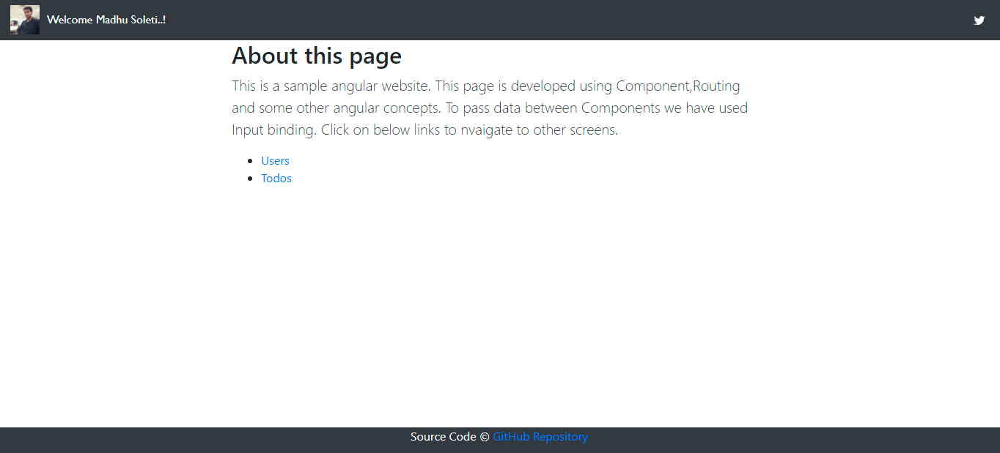
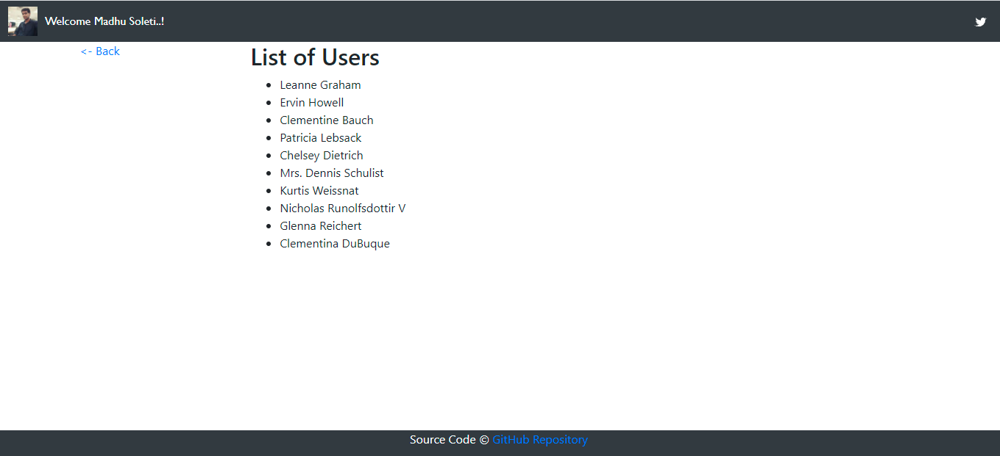

# Project Name: CodeTest
This project was generated with [Angular CLI](https://github.com/angular/angular-cli) version 11.2.4.

## Concepts Covered
* Common Header and Footer
* Component including input properties
* External links to Anchor Tag
* Dynamic Content in Component 
* Routing
* Http calls for an third-party API
* Basic Unit Tests
* Mock service for Unit Test

## Running the Application with Node.js
1. Install the Node.js from https://nodejs.org.

2. Simply clone the project or download and extract the .zip

3. Run npm install to install app dependencies

4. Run `ng serve` to build and serves app, rebuilding on file changes

5. Go to `http://localhost:4200` in  browser

## Running unit tests
Run `ng test` to execute the unit tests via [Karma](https://karma-runner.github.io).

Here are a few screenshots from the sample app:

  

